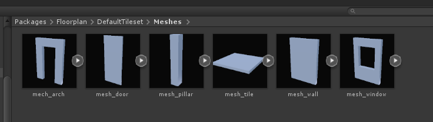
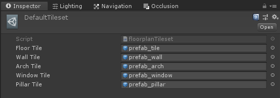
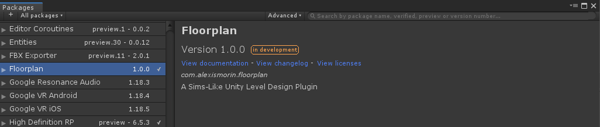

# floorplan
## A Sims-Like Unity Level Design Plugin

### About

While I do tend to appreciate level design prototyping tools like ProBuilder, I feel that ultimately they kind of turn into a hindrance when it's time to turn their scratch geometry into a final level. For my less minimalistic projects, I tend to use the "modular kit" workflow, where I use a small ammount of tileable meshes (eg. floor tiles, wall tiles, door arches, etc) that I turn into prefabs, place inside of the scene and then iterate on in Maya. While I find it the most comfortable workflow for me, I still had the pain point of having to place a bunch of items in the scene afterwards. Enough with the copy-pasting!

With this package, you can then turn these simple prefabs into a small tileset data asset, then one-click-spawn the tool into a scene and start dispatching them as you would when building a house in the Sims. While it's far from perfect in its current state, it's a lot more intuitive, saves a hell of a lot of copy-pasting - and you can be sure that what you build is scaled properly to your characters from the get-go. No more low ceilings and off-proportioned doors!

### Controls / Basic Workflow
- For the default tileset configuration, make sure that your vertical snapping is  3m - this is the height of one floorplan tile.
- Use the *Tools/Add Floorplan Handle* menu item to add a floorplan handle to your scene. The floorplan handle is the item you will drag around to create geometry
- Toggle own a spawn option; walls, pillars, or floors. Pillars are automatically spawned on corners - pillars are automatically spawned on wall corners already, but toggling the option on might be good for attics or basements.
- Press the spacebar (the red node will turn green) to toggle the tool on or off. With the tool active, you can now simply move the handle across the scene to spawn items.
- Once you're done spawning, just press the spacebar again to disable the handle. If you're missing a few tiles or pillars, you can move the handle where needed and manually spawn some with the *Spawn Pillar* or *Spawn Floor* button.
- If you click on any mesh spawned by the handle, you can turn it into a door arch or a windowed wall.

The meshes aren't logged anywhere - I will revisit once I use this tool in a real project but I assume that the best practice would be doing a rough pass with this then manually adding/deleting prefabs where needed.

### Custom Tilesets
You can have multiple custom tilesets spawning different looking buildings in the same project - look into the DefaultTilekit folder and copy to your heart's contents.

### Install process
This is a plugin that makes use of Unity's new *Package Manager* feature. Just drop the *com.alexismorin.floorplan* folder into your *packages* folder (found at the same level as your Assets folder) and it should work out-of-the-box.

### Compatibility
- If you import this package in Unity 2018.3 or older, you might have to adjust the default tileset prefab for walls and pillars as the downgrade might mess with them a bit.

### Changelog:
- April 24: You  don't need to hold down the control key to snap anymore, it'll snap things automatically for you.
- April 24: Windows & Arches are now properly instanced as prefabs as well.

### TODO
- More basic tile types (e.g stairs or bannisters)
- Less messy floor placement solution
- Stairs and roofs
- Better control on doors
- More pleasant UX

This was, as is it par with all my packages, created in around 5-6 hours on my couch. If it doesn't break for you, enjoy!
